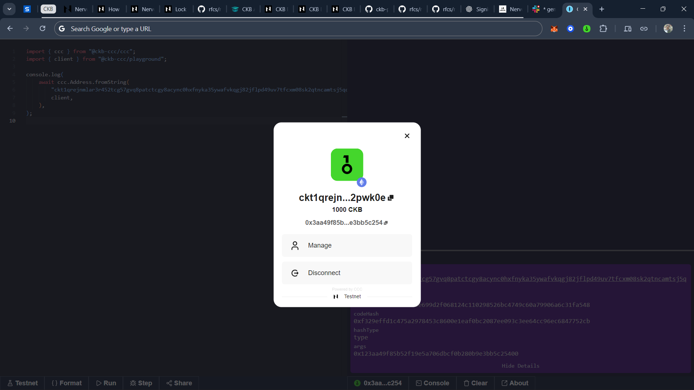

# How to get details from a CKB Address

Visit: [CKB Playground](https://live.ckbccc.com/) and run the following script:

```ts
import { ccc } from "@ckb-ccc/ccc";
import { client } from "@ckb-ccc/playground";

console.log(
  await ccc.Address.fromString(
    "ckt1qrejnmlar3r452tcg57gvq8patctcgy8acync0hxfnyka35ywafvkqgj82jflpd49uv7tfcxm08sk2qtncamtsj5qq2pwk0e",
    client
  )
);

// Replace the wallet address with yours
// My OneKey wallet address on testnet (above as ckt...)
```

Output on Console:

```ts
address: ckt1qrejnmlar3r452tcg57gvq8patctcgy8acync0hxfnyka35ywafvkqgj82jflpd49uv7tfcxm08sk2qtncamtsj5qq2pwk0e;

scriptHash: 0xfa394d2767135a3be699d2f068124c110298526bc4749c60a79906a6c31fa548;

// OMNILOCK
codeHash: 0xf329effd1c475a2978453c8600e1eaf0bc2087ee093c3ee64cc96ec6847752cb;

hashType: type;

// My Wallet Address
args: 0x123aa49f85b52f19e5a706dbcf0b280b9e3bb5c25400;

// Note: The `args` value from your address is used in the transaction `lock` field when signing a transfer.
```

## Screenshots

How to get the `ckt...` address by cnnecting your OneKey Wallet.



CKB Playground output showing the address, codehash, hashtype, and args used for transaction signing.


