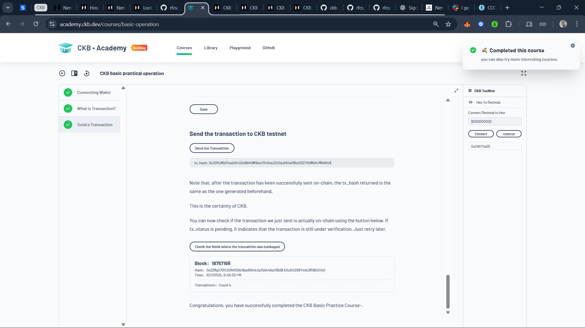
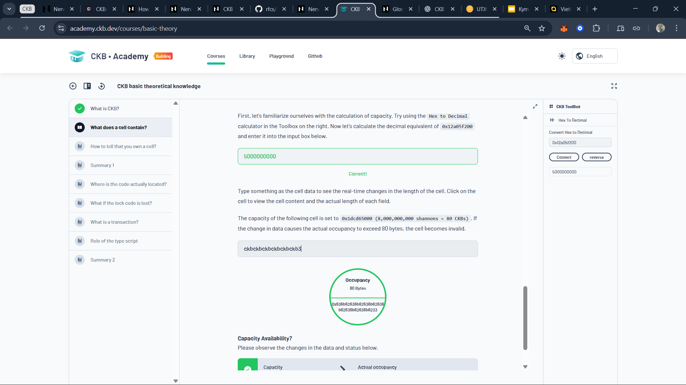
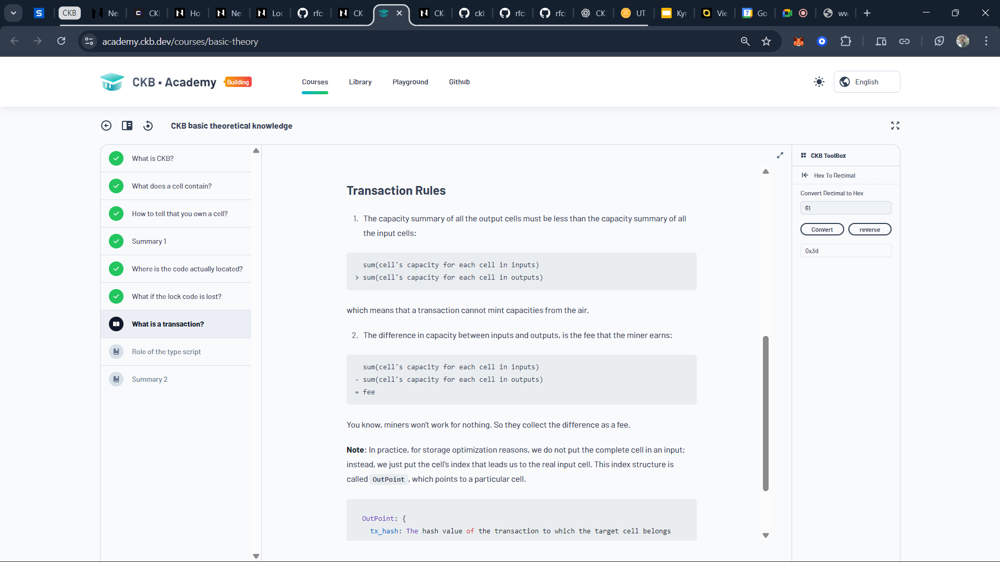
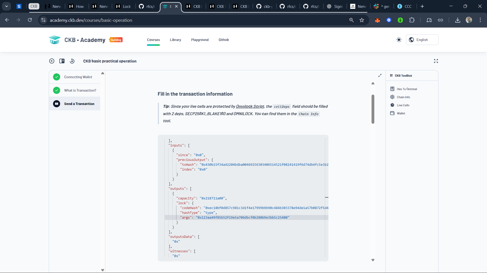
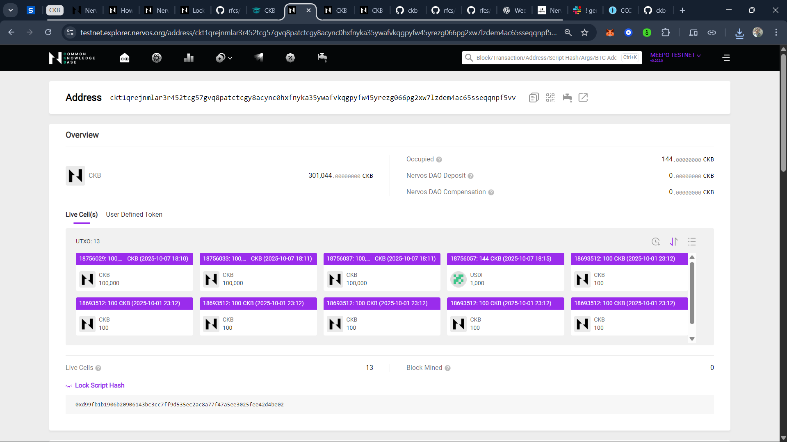
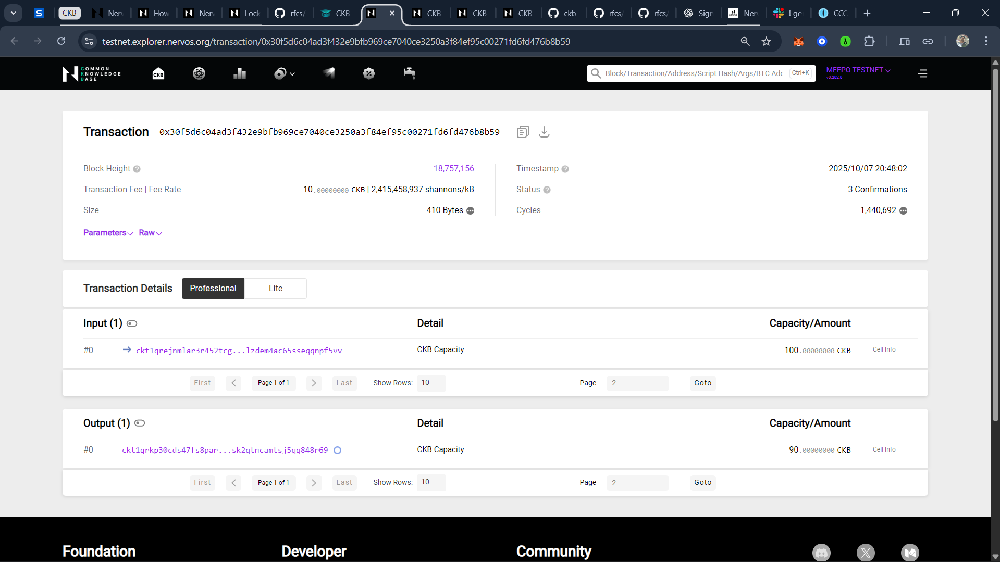

## Week 02

**Date:** 1st - 7th Oct, 2025

### Tasks Completed

→ Finished _2 Courses_ on _CKB Academy_:

<table style="width:100%; text-align:center;">
  <tr>
    <td style="width:50%; vertical-align:top; text-align:center;">
      
      
1. <a href="https://academy.ckb.dev/courses/basic-theory">Basic Theory Course</a>

    </td>
    <td style="width:50%; vertical-align:top; text-align:center;">
      
      
2. <a href="https://academy.ckb.dev/courses/basic-operation">Basic Operation Course</a>

    </td>
  </tr>
</table>

→ Covered these tech-terms by courses & docs:

- [Cell](https://docs.nervos.org/docs/tech-explanation/cell)
- [CKB (CKByte)](https://www.notion.so/adisuyash/CKByte-1-Byte-2836226f9e0380cda3f2cf0fec53847e) & Shannon (1 CKB = 10^8 shannons)
- [UTXOs in BTC](https://www.notion.so/adisuyash/UTXO-Bitcoin-2856226f9e0380588a61c07eb5b2b6fc)
- [CKB vs BTC](https://docs.nervos.org/docs/tech-explanation/ckb-vs-btc)
- CKB Transaction structure: inputs, outputs, cellDeps, witnesses

→ Learnt basic transaction flow on CKB (creating, destroying, managing cells).

### Practical Exercises

- Connected wallet, explored Toolbox (Hex ⇄ Decimal, Chain Info, Live Cells).
- Completed manual transfer transaction:
  - Filled in `cellDeps` (SECP256K1_BLAKE160 + OMNILOCK)
  - Prepared raw transaction (`version`, `headerDeps`, `cellDeps`)
- Generated transaction hash (tx_hash)
- Learned WitnessArgs structure: `lock`, `input_type`, `output_type`
- Signed transaction via wallet, serialised witnessArgs
- Added serialised signature and sent transaction to Testnet
- Verified transaction on-chain (tx_hash matched, confirmed)

### Related Snapshots (for notes)

<table style="width:100%; text-align:center;">
  <tr>
    <td style="width:33.3%; vertical-align:top; text-align:center;">
      
      
Capacity of a Cell

    </td>
    <td style="width:33.3%; vertical-align:top; text-align:center;">
      
      
Transaction Rules

    </td>
    <td style="width:33.3%; vertical-align:top; text-align:center;">
      
      
Filled Cell Details

    </td>
  </tr>
</table>

<table style="width:100%; text-align:center;">
  <tr>
    <td style="width:50%; vertical-align:top; text-align:center;">
      
      
CKB Address on Testnet

    </td>
    <td style="width:50%; vertical-align:top; text-align:center;">
      
      
Transferred 90 CKB

    </td>
  </tr>
</table>

### Key Learnings

- CKB operates as a **chain of cells**, constantly created and destroyed
- **Ownership of cells** is protected by lock scripts; **type scripts** govern cell transformations
- Constructing a transaction involves: filling in dependencies, generating tx_hash, signing with lock scripts, serializing witnessArgs, sending on-chain, and verifying status
- Hands-on practice reinforces the **concept of cells, locks, and transaction lifecycle**
- Using **Toolbox and Live Cells** simplifies manual transaction creation and reduces errors
- Understanding the **transaction lifecycle** is essential before moving to advanced tutorials

