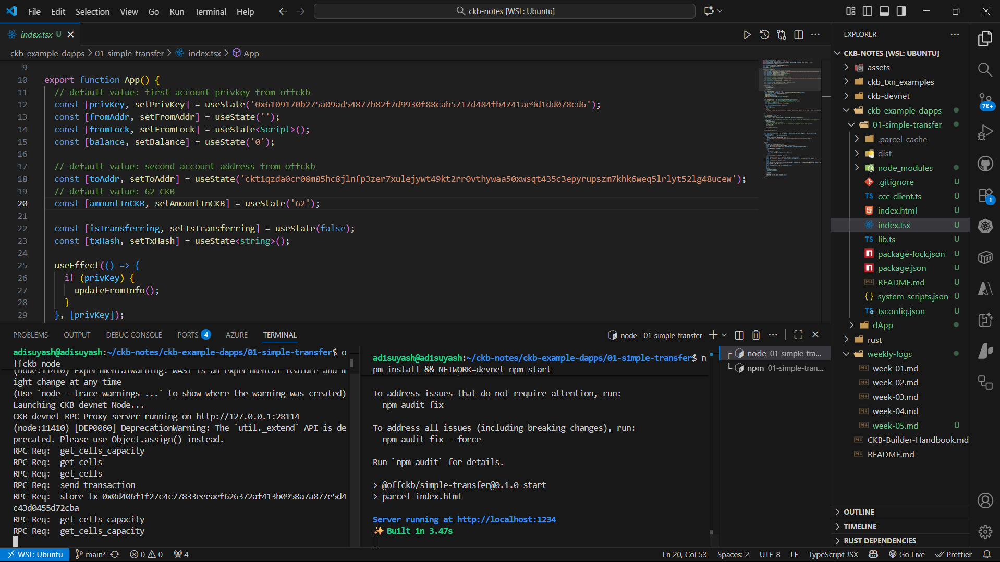
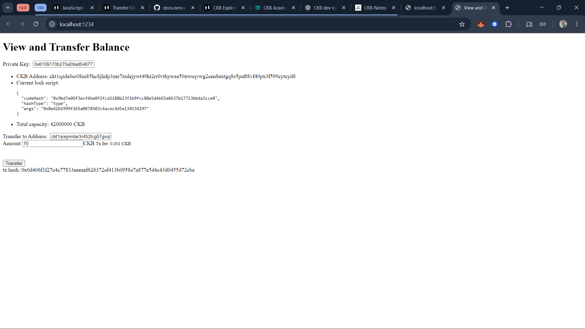

## Week 05

**Date:** 23rd - 30th Oct, 2025

### Tasks Completed

### CKB Development Progress

Learnt about the Nervos CKB dApp development by completing two tutorials from official docs:

1. [Transfer CKB](https://docs.nervos.org/docs/dapp/transfer-ckb)
2. [Store Data on Cell](https://docs.nervos.org/docs/dapp/store-data-on-cell)

#### 1. Transfer CKB:

- Setup up the devnet node and ran it using `offckb node`.
- Generated local devnet accounts using `offckb accounts` in a new terminal.
- Performed the transaction on the local devnet.
- Further, created an `.env` file with `NETWORK=testnet` and switched to testnet environment
- Re-deployed, and successfully reproduced the same transaction flow using faucet-funded accounts.
- Related screenshots:
    <table style="width:100%; text-align:center;">
    <tr><td style="width:33.3%; vertical-align:top; text-align:center;">
    
    
1. <a href="https://docs.nervos.org/docs/dapp/transfer-ckb">Transfer dApp - Local Setup</a>

    </td>
    <td style="width:33.3%; vertical-align:top; text-align:center;">
    
    
2. Transferred Funds on Testnet

    </td>
    <td style="width:33.3%; vertical-align:top; text-align:center;">
    
    
3. <a href="https://testnet.explorer.nervos.org/transaction/0x52ebe20f02629201eb89f4283f79f4709d2e4d68a67d5effd4c9dbdc72aed14f">Explorer Link</a>

    </td></tr>
    </table>

#### 2. Store Data on Cell:

- Setup up the devnet node and ran it using `offckb node`.
- Generated local devnet accounts using `offckb accounts` in a new terminal.
- Performed the storage transaction on the local devnet.
- Further, created an `.env` file with `NETWORK=testnet` and switched to testnet environment.
- Stored a message `Aditya storing values on CKB Testnet` over the testnet and understood how data is encoded, stored, and retrieved on-chain.
- Related screenshots:
    <table style="width:100%; text-align:center;">
    <tr><td style="width:33.3%; vertical-align:top; text-align:center;">
    
    
1. <a href="https://docs.nervos.org/docs/dapp/store-data-on-cell">Store Data on Cell - Local Setup</a>

    </td>
    <td style="width:33.3%; vertical-align:top; text-align:center;">
    
    
2. Stored Message on Cell

    </td>
    <td style="width:33.3%; vertical-align:top; text-align:center;">
    
    
3. Read Data & <a href="https://testnet.explorer.nervos.org/transaction/0xd0b38c88aa0553c29b4634797bb70b0be26610b3c0737d450db129bc4a121e64">Explorer Link</a>

    </td></tr>
    </table>

### References

- [Transfer CKB](https://docs.nervos.org/docs/dapp/transfer-ckb) | [Store Data on Cell](https://docs.nervos.org/docs/dapp/store-data-on-cell)
- [Faucet](https://faucet.nervos.org/) | [Testnet Explorer](https://testnet.explorer.nervos.org/)
