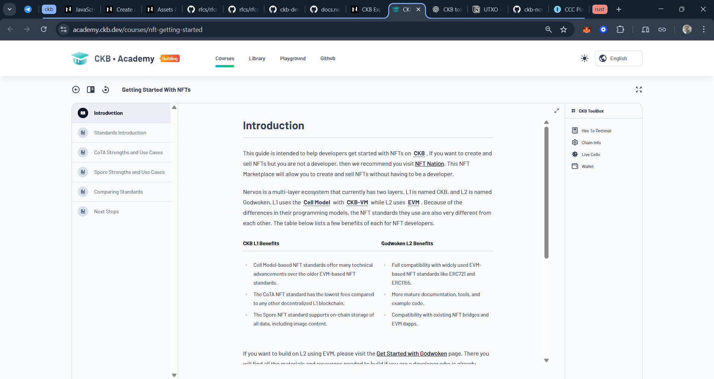
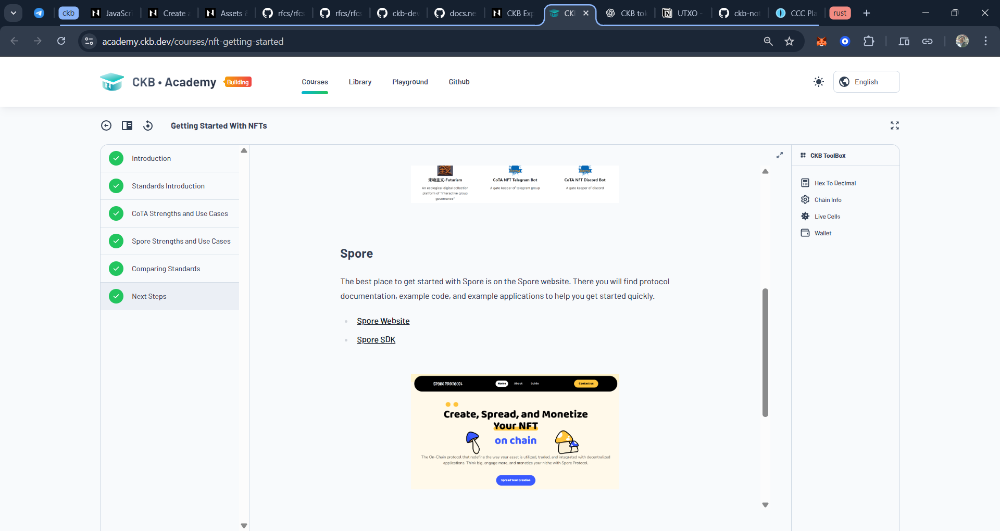

## Week 07

**Date:** 11th - 18th Nov, 2025

### Tasks Completed

- Completed the full [Getting Started With NFTs](https://academy.ckb.dev/courses/nft-getting-started) course from [CKB Academy](https://academy.ckb.dev/) and learned how NFT standards work on Nervos Layer 1.

<table style="width:100%; text-align:center;">
  <tr>
    <td style="width:50%; vertical-align:top; text-align:center;">
      
      
1. <a href="https://academy.ckb.dev/courses/nft-getting-started">NFTs Course - Started</a>

    </td>
    <td style="width:50%; vertical-align:top; text-align:center;">
      
      
2. <a href="https://academy.ckb.dev/courses/nft-getting-started">NFTs Course - Finished</a>

    </td>
  </tr>
</table>

### Key Concepts Learned

- Understood how NFTs differ between CKB L1 (Cell Model + CKB-VM) and Godwoken L2 (EVM), and why their standards differ.
- Learned the history of NFT standards and limitations of ERC721/1155 (high fees, poor permanence, storage constraints).
- Studied CKB’s template-based smart contract approach and why reusing existing NFT standards is recommended.

### CoTA NFT Standard
- Learned that CoTA (Compact Token Aggregator) uses off-chain NFT data with on-chain SMT (Sparse Merkle Tree) proofs.
- Understood the structure and purpose of the CoTA Cell, used to store a single 32-byte root for an unlimited number of NFTs.
- Learned why CoTA NFTs are extremely cheap to mint/transfer (typically < $0.01).
- Understood use cases:
  - Art, collectibles, games
  - Tickets & POAPs
  - Real-world asset tokens
  - High-volume, low-cost NFT systems

### Spore NFT Standard
- Learned that Spore stores all content fully on-chain, including images or audio.
- Understood how Spore uses a separate cell per NFT and requires a CKB deposit equal to data size (1 byte = 1 CKB).
- Learned about permanence guarantees, immutability, and decentralized storage.
- Understood use cases:
  - High-value art
  - Pixel art & low data images
  - Tokenized real estate, stocks, loans
  - Anything requiring long-term on-chain availability

### CoTA vs Spore - Comparison
- Compared cost, permanence, usage, SDK availability, and storage model.
- Understood that:
  - CoTA = Low cost, scalable, off-chain data with SMT proofs
  - Spore = Fully on-chain content with strong permanence guarantees

### References

- [Getting Started With NFTs - CKB Academy](https://academy.ckb.dev/courses/nft-getting-started)
- [Faucet](https://faucet.nervos.org/) | [Testnet Explorer](https://testnet.explorer.nervos.org/)
