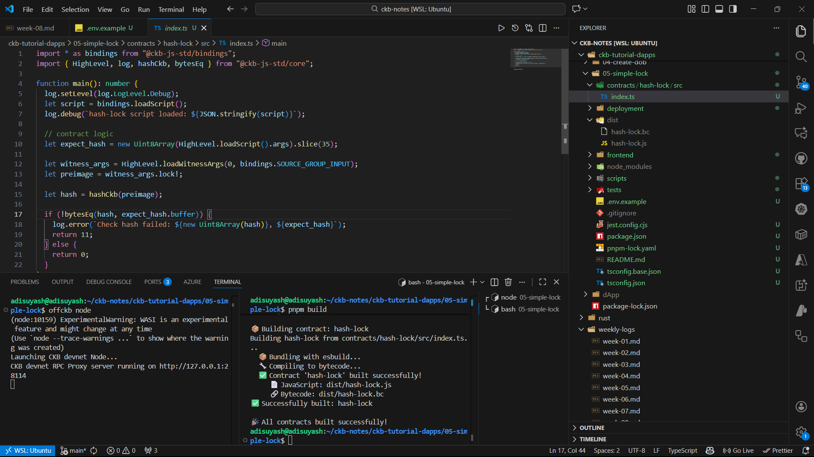
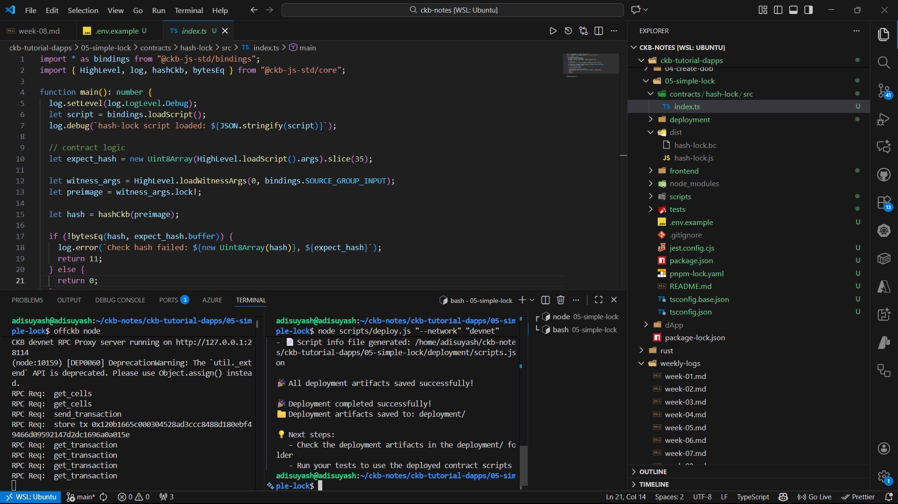
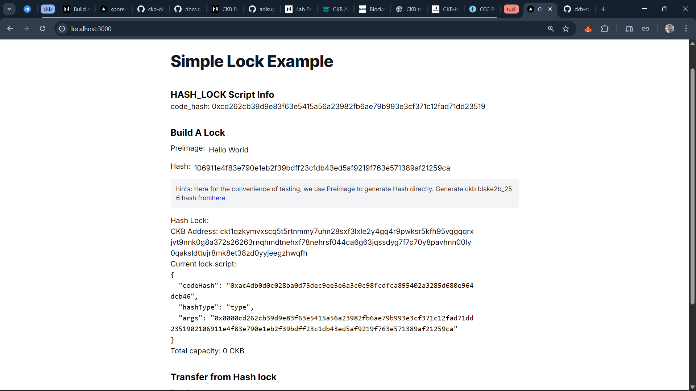

## Week 09

**Date:** 25th - 30th Nov, 2025

### Tasks Completed

### CKB Development Progress - Built Custom Lock Script (Simple Lock)

Completed the [Build a Simple Lock tutorial](https://docs.nervos.org/docs/dapp/simple-lock) and created a full-stack dApp that uses a custom Lock Script (`hash_lock`) to control access to CKB tokens based on a preimage–hash verification.

#### Progress & Implementation

- Set up the Devnet environment using `offckb node`.
- Installed dependencies and built the TypeScript smart contract:

  ```bash
  pnpm install
  pnpm build
  ```

  This produced:

  - `dist/hash-lock.js` - JS bundled contract
  - `dist/hash-lock.bc` - Bytecode for CKB-VM

- Installed `ckb-debugger` (required for contract compilation):

  ```bash
  cargo install ckb-debugger
  ```

  This fixed the missing binary error during contract build.

- Compiled and deployed the `hash_lock` script to Devnet using:

  ```bash
  node scripts/build-all.js
  node scripts/deploy.js --network devnet
  ```

  Deployment artifacts were generated under `deployment/devnet/`.

#### Frontend Setup & Interaction

- Copied `scripts.json` from `deployment/` into `frontend/deployment/` to allow the frontend to recognize the deployed contract.
- Started the frontend UI:

  ```bash
  cd frontend
  npm install
  npm run dev
  ```

  dApp was accessible at `http://localhost:3000/`.

- Entered a hash in the UI to generate a `hash_lock address`.
  This lock script embeds:

  - `code_hash` of the deployed `hash_lock` contract
  - `hash_type` as `type`
  - `args` as the SHA-256 hash of the preimage

- Deposited CKB into the generated address (e.g., 300 CKB):

  ```bash
  offckb deposit --network devnet <hash-lock-address> 300
  ```

- Used the UI to transfer CKB from this lock address:
  - Clicking "Transfer" prompts for the **preimage**.
  - When the correct preimage is provided → transaction succeeds.
  - Incorrect preimage → transaction is rejected by hash_lock script.

#### Key Concepts Learned

##### 1. Contract Logic (On-Chain)

Inside `contracts/hash-lock/src/index.ts`, understood:

- `HighLevel.loadScript().args` → loads expected hash.
- `HighLevel.loadWitnessArgs()` → loads the preimage from witness.
- `hashCkb()` → computes blake2b-256 hash.
- Script returns:
  - 0 → success
  - 11 → hash mismatch

##### 2. How the Lock Script address is generated

- `generateAccount(hash)` constructs:

  ```bash
  args = 0x0000 | <script_code_hash> | <hash_type_bytes> | <expected_hash>
  ```

  and wraps it into a CKB-JS-VM script.

- Address conversion done using:
  ```ts
  ccc.Address.fromScript(lockScript, cccClient);
  ```

##### 3. Querying balance

- Used `cccClient.getBalance(address)` to fetch CKB balance of the custom lock address.

##### 4. Unlocking (Building Transaction with CCC)

- Creates a transaction with a new output (receiver lock).
- Applies user input (preimage) as the new witness.
- Adds cell deps (hash_lock + ckb-js-vm).
- Completes inputs & capacity.
- Broadcasts via:

  ```ts
  cccClient.sendTransaction(tx);
  ```

- Related screenshots:
    <table style="width:100%; text-align:center;">
    <tr><td style="width:33.3%; vertical-align:top; text-align:center;">
    
    <p style="text-align:center;">1. <a href="https://docs.nervos.org/docs/dapp/simple-lock">Simple Lock - Local Setup</a></p>
    </td>
    <td style="width:33.3%; vertical-align:top; text-align:center;">
    
    <p style="text-align:center;">2. Deployment Success</p>
    </td>
    <td style="width:33.3%; vertical-align:top; text-align:center;">
    
    <p style="text-align:center;">3. Hash Lock Created & Transaction Displayed</p>
    </td></tr>
    </table>

### References

- [Build a Simple Lock - dApp tutorial](https://docs.nervos.org/docs/dapp/simple-lock)
- [Faucet](https://faucet.nervos.org/) | [Testnet Explorer](https://testnet.explorer.nervos.org/)
