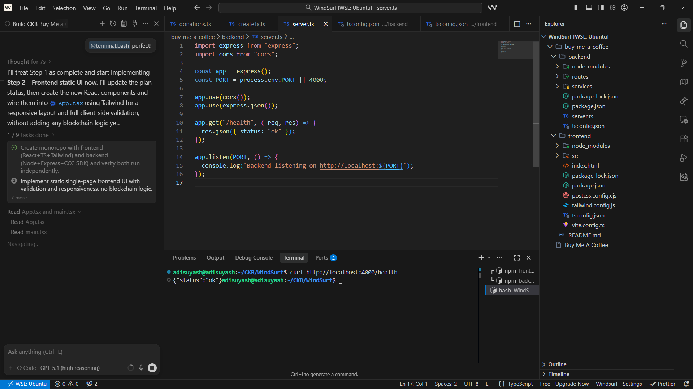
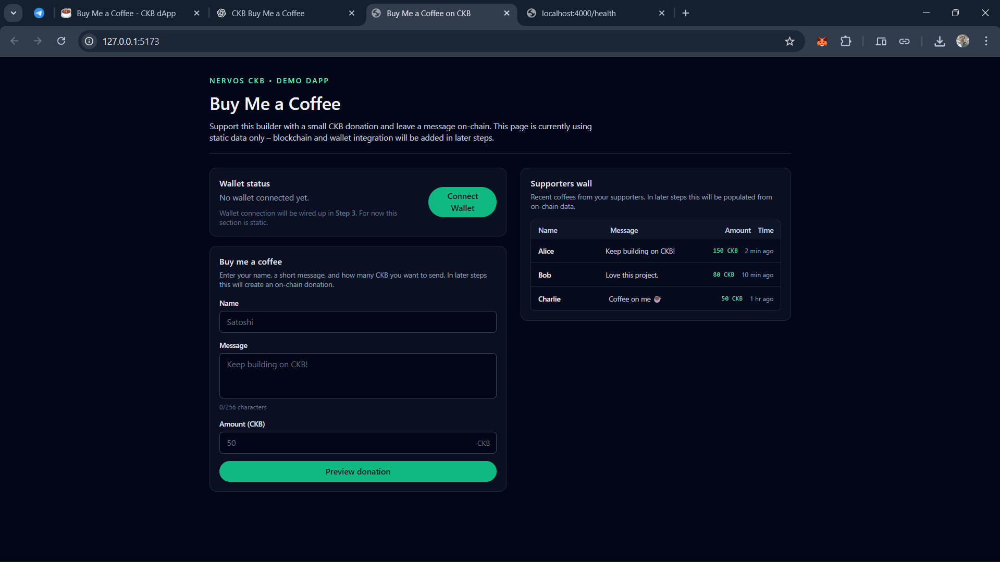

## Week 11

**Date:** 11th - 18th December, 2025

### Tasks Completed

- Created a **monorepo** with:
  - Frontend using **React + TypeScript + Tailwind CSS**
  - Backend using **Node.js + Express + CCC SDK**
- Verified that both frontend and backend run independently.
- Implemented [Module 1: Static UI](https://www.notion.so/adisuyash/Buy-Me-a-Coffee-CKB-dApp-2c46226f9e0380229713f2b7f3da55a3?source=copy_link#2d26226f9e03802a8006fa83b8af90cb) for the Buy Me a Coffee–style crowdfunding dApp, including:

  - Header with title
  - Wallet status (dummy state)
  - Donation form (name, message, amount buttons)
  - Mock donation history / wall of fame

- Related screenshots:
    <table style="width:100%; text-align:center;">
    <tr><td style="width:50%; vertical-align:top; text-align:center;">
    
    
1. dApp - Monorepo Setup

    </td>
    <td style="width:50%; vertical-align:top; text-align:center;">
    
    
2. Static UI - Form & Donation History

    </td></tr>
    </table>

### Next Steps
- Integrate real wallet connection using CCC SDK.
- Replace dummy wallet state with actual CKB address handling.
- Prepare the UI for transaction flow and on-chain interactions.
