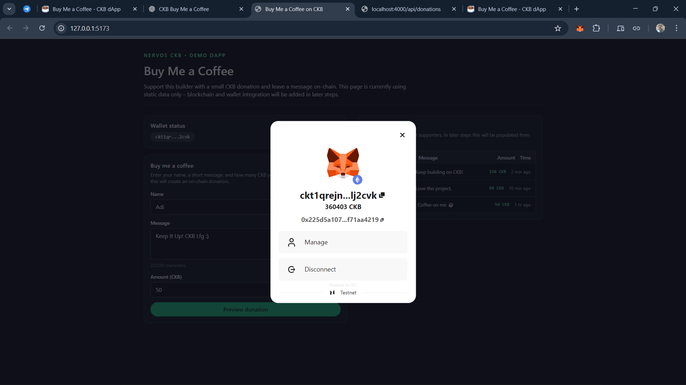
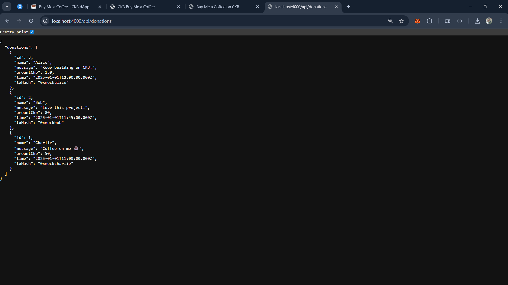
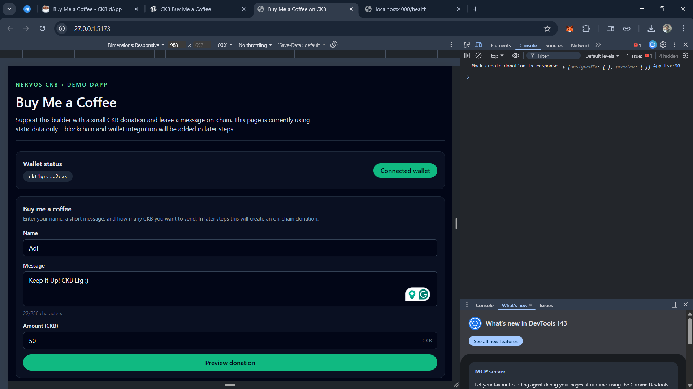
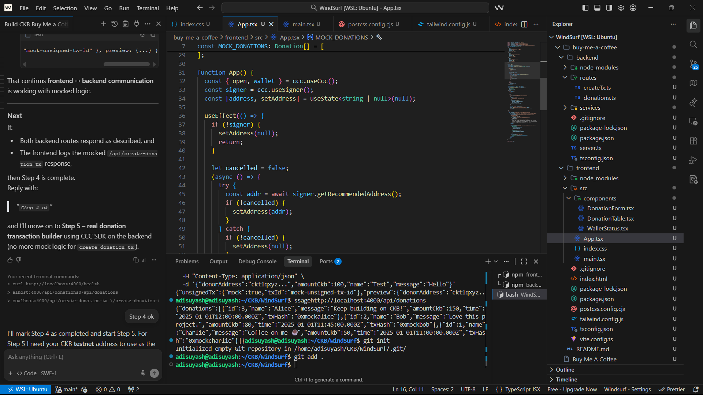

## Week 12

**Date:** 19th – 27th December, 2025

### Tasks Completed

- Implemented [Module 2: Real Wallet Connection](https://www.notion.so/adisuyash/Buy-Me-a-Coffee-CKB-dApp-2c46226f9e0380229713f2b7f3da55a3?source=copy_link#2d26226f9e03808593fff3a12a2b5629) using CCC SDK.
  - Enabled wallet connection (JoyID / Nexus).
  - Displayed connected donor’s CKB address.
  - Disabled donation form until wallet is connected.

<table>
  <tr>
    <td align="center">
      
      
1. Wallet Connected State

    </td>
  </tr>
</table>

- Implemented [Module 3: Backend Transaction Builder](https://www.notion.so/adisuyash/Buy-Me-a-Coffee-CKB-dApp-2c46226f9e0380229713f2b7f3da55a3?source=copy_link#2d26226f9e038009a91fd0598a7ad3e5).
  - Set up Express API to construct unsigned CKB transactions.
  - Encoded donor name and message into the cell `data` field.
  - Verified backend returns valid transaction JSON.

<table>
  <tr>
    <td align="center" width="33%">
      
      
2. API Donations

    </td>
    <td align="center" width="33%">
      
      
3. Transaction Builder

    </td>
    <td align="center" width="33%">
      
      
4. API Testing

    </td>
  </tr>
</table>

### Next Steps

- Implement **Module 4: Sign & Send**:
  - Wire frontend → backend → wallet signing flow.
  - Broadcast signed transactions to CKB testnet.
  - Display success state with transaction hash.
- Proceed with **Module 5: Show Real Donations** by indexing on-chain data.
- Complete **Module 6: Polish** to reach a production-ready MVP.
